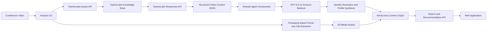

# Conference People Context Graph

> Turn conference videos into a searchable network of people, expertise,
> conversations, and evidence.

This project is being built for the
[Hack the Video Agent Context Graph](https://luma.com/hack-video-agent-context-graph-jul30-2026)
hackathon.

## Project Summary

Conference recordings contain valuable knowledge about speakers, attendees,
topics, and conversations, but that information remains locked inside hours of
video.

Conference People Context Graph converts recorded sessions and conversations
into structured, searchable professional profiles. Users can search for a
person, technology, industry, or research topic and discover relevant experts,
related speakers, their conversations, and the exact video moments supporting
each result.

The project uses:

- **TwelveLabs** to understand video across vision, audio, speech, and on-screen
  content.
- **OpenAI GPT-5.6** to reason over extracted context and generate structured
  profiles.
- **Strands Agents** to orchestrate the video-to-graph pipeline.
- **AWS** to run GPT-5.6 through Amazon Bedrock and host the supporting
  infrastructure.
- **Neo4j Aura** to store and query the people context graph.

## Problem

Conference participants often want to answer questions such as:

- Who spoke about GraphRAG?
- Which speakers work in healthcare AI?
- Who discussed both video understanding and knowledge graphs?
- What did a specific speaker say about a topic?
- Which people share similar interests?
- Where in the original video is the evidence?

Manually watching every recording and researching every person is too slow.
Traditional keyword search also loses the relationships between people, topics,
sessions, and conversations.

## Proposed Solution

The system processes conference videos and automatically:

1. Detects speech, visual context, on-screen text, scenes, and important
   timestamps.
2. Identifies individual speakers and separates their utterances.
3. Extracts names, organizations, professional domains, topics, and claims.
4. Creates a structured profile for each person.
5. Links every extracted fact to its source video segment.
6. Stores people, topics, sessions, and evidence in Neo4j.
7. Provides a web interface for semantic and graph-based discovery.

Each generated profile follows a structure similar to:

```json
{
  "name": "Speaker name",
  "organization": "Company or institution",
  "role": "Professional role",
  "domains": ["Artificial Intelligence"],
  "topics": ["GraphRAG", "Video Understanding"],
  "profileSummary": "Short evidence-grounded biography",
  "statements": [
    {
      "text": "What the person said",
      "startSec": 125.4,
      "endSec": 142.1,
      "confidence": 0.91
    }
  ],
  "portraitUrl": "Representative frame",
  "sourceVideoUrl": "Original recording"
}
```

Names that cannot be determined reliably remain `Unknown Speaker 1`,
`Unknown Speaker 2`, and so on until they are manually confirmed. The system
does not invent identities.

## Architecture



### Technology Responsibilities

| Technology | Responsibility |
| --- | --- |
| TwelveLabs | Multimodal video understanding, entity and topic extraction, timestamp discovery, and corpus-level video reasoning |
| Strands Agents | Ingestion, polling, extraction, reasoning, validation, and database-write orchestration |
| OpenAI GPT-5.6 | Data normalization, entity resolution, profile creation, tool calls, and user-query interpretation |
| Amazon Bedrock | GPT-5.6 inference using AWS credits and AWS-managed infrastructure |
| AWS | S3 media storage, backend services, observability, and application hosting |
| Neo4j Aura | Context graph storage and relationship discovery |
| Web application | Person and topic search, profiles, graph visualization, and evidence playback |

TwelveLabs' workflow is to create an asset, wait until it is ready, add it to a
knowledge store, wait for indexing, and query the Responses API. Its structured
output support allows the extraction pipeline to return schema-constrained JSON.
See the
[TwelveLabs quickstart](https://docs.twelvelabs.io/agents/get-started/quickstart/create-a-response)
and
[structured-output guide](https://docs.twelvelabs.io/agents/guides/create-a-response/structured-output).

## Agent Design

The runtime agent is implemented with **Strands Agents**, as specified by the
hackathon challenge.

### Agent Tools

- `upload_video`
- `check_asset_status`
- `add_to_knowledge_store`
- `extract_video_context`
- `extract_representative_frame`
- `resolve_person_identity`
- `validate_profile`
- `write_context_graph`
- `search_people`
- `retrieve_evidence`

### GPT-5.6 Model Routing

- **GPT-5.6 Luna:** Fast, high-volume cleanup, tagging, classification, and
  routing.
- **GPT-5.6 Terra:** Main profile generation, entity normalization, and
  user-query interpretation.
- **GPT-5.6 Sol:** Difficult identity reconciliation, cross-session reasoning,
  and complex graph questions.

All three models are available through the OpenAI-compatible Responses API on
Amazon Bedrock. See the
[AWS GPT-5.6 Bedrock guide](https://aws.amazon.com/blogs/machine-learning/get-started-with-openai-gpt-5-6-sol-terra-and-luna-on-amazon-bedrock/).

The integration demonstrates:

- Multimodal input
- Structured JSON output
- Function calling
- Programmatic or code-based tool calling
- Reasoning-effort configuration
- Persisted reasoning for multi-turn search
- Context compaction for long-running agent sessions

See the
[OpenAI GPT-5.6 model guidance](https://developers.openai.com/api/docs/guides/latest-model)
for current capability and prompting details.

## Neo4j Context Graph

### Node Model

```text
(:Person)
(:Organization)
(:Domain)
(:Topic)
(:Conference)
(:Session)
(:MediaAsset)
(:TranscriptSegment)
(:TranscriptChunk)
```

### Relationships

```text
(:Person)-[:WORKS_AT]->(:Organization)
(:Person)-[:SPECIALIZES_IN]->(:Domain)
(:Person)-[:SPOKE_IN]->(:TranscriptSegment)
(:Person)-[:PRESENTED_AT]->(:Session)
(:Session)-[:PART_OF]->(:Conference)
(:Session)-[:RECORDED_AS]->(:MediaAsset)
(:TranscriptSegment)-[:FROM_ASSET]->(:MediaAsset)
(:TranscriptSegment)-[:DISCUSSES]->(:Topic)
(:TranscriptSegment)-[:HAS_CHUNK]->(:TranscriptChunk)
(:Topic)-[:BELONGS_TO]->(:Domain)
```

Relationship properties hold extraction confidence, timestamps, frequency, and
evidence counts. Embeddings are stored on dedicated `TranscriptChunk` nodes
rather than directly on `Person` nodes.

### Questions the Graph Must Answer

1. Find people who discussed a selected topic.
2. Find people with expertise across multiple selected domains.
3. Find speakers related through shared topics or sessions.
4. Show the exact evidence supporting a person's profile.
5. Discover topics frequently discussed together.
6. Recommend people similar to a selected speaker.
7. Search conversation content semantically and traverse back to the speaker.

Neo4j Aura Free is sufficient for the hackathon MVP. The
[Neo4j Agent Skills](https://neo4j.com/labs/genai-ecosystem/agent-skills/neo4j-skills/)
support Aura, modeling, Cypher, imports, vector search, and GraphRAG workflows.

## Web Experience

### Search

Users can enter natural-language queries such as:

- "Find speakers working on AI agents for healthcare."
- "Who talked about Neo4j and video understanding?"
- "Show people interested in multimodal search."
- "What did Alice say about graph databases?"

Each result displays:

- Name and representative image
- Organization and role
- Domains and topics
- Short profile summary
- Relevance explanation
- Supporting quotes
- Playable timestamped video evidence
- Related people

### Person Profile

A profile contains:

- Professional summary
- Domains and expertise
- Conference appearances
- Extracted conversations
- Evidence clips
- Related speakers
- Interactive local graph

## Hackathon MVP

### Must Have

- Upload one or more conference videos.
- Process them through TwelveLabs.
- Extract at least three people and their statements.
- Generate structured person profiles.
- Store people, topics, segments, and relationships in Neo4j.
- Search by person, domain, or topic.
- Open a profile and play the supporting video timestamp.
- Display related people through graph connections.

### Stretch Goals

- Cross-video identity resolution
- Interactive Neo4j graph visualization
- Natural-language graph questions
- Real-time ingestion during a conference
- User corrections for speaker identity
- Contact or meeting recommendations
- Multilingual transcript search

## One-Day Execution Plan

### Phase 1: Foundation

- Configure AWS credentials and Bedrock model access.
- Create an S3 bucket and Neo4j Aura instance.
- Configure TwelveLabs API credentials and a knowledge store.
- Install and verify the Agent Toolkit for AWS and Neo4j Agent Skills.

The current official AWS name is **Agent Toolkit for AWS**. For Codex, AWS
documents marketplace installation or the `aws configure agent-toolkit` setup
flow in the
[Agent Toolkit quickstart](https://docs.aws.amazon.com/agent-toolkit/latest/userguide/quick-start.html).

### Phase 2: Video Pipeline

- Upload one short test video.
- Wait for TwelveLabs asset and knowledge-store readiness.
- Request schema-constrained extraction.
- Produce speaker, transcript, topic, and timestamp JSON.
- Extract representative frames from the source video using those timestamps.

### Phase 3: Graph and Reasoning

- Create Neo4j constraints and indexes.
- Normalize people, topics, and domains with GPT-5.6.
- Write the context graph.
- Implement name, full-text, and semantic search.
- Verify that every generated profile has source evidence.

### Phase 4: Web and Demo

- Build search and profile pages.
- Add timestamped video playback.
- Add a related-people graph.
- Prepare three reliable demo queries.
- Preprocess demo videos to avoid waiting for indexing during judging.

## Demo Story

1. Upload a conference recording.
2. Show the multimodal context extracted by TwelveLabs.
3. Show the agent generating structured person profiles.
4. Open Neo4j and display the resulting context graph.
5. Search for "Who discussed multimodal AI and knowledge graphs?"
6. Select a person and inspect their profile.
7. Play the exact video segment supporting the result.
8. Open a related person and explain the graph path connecting them.

**Closing message:** Conference People Context Graph turns unstructured video
into a living professional knowledge network, allowing users to discover not
only what was said, but who said it, where the evidence is, and how people and
ideas are connected.
